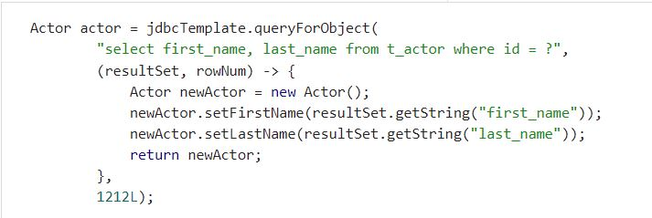
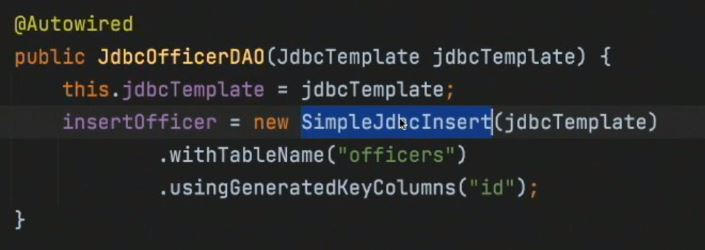
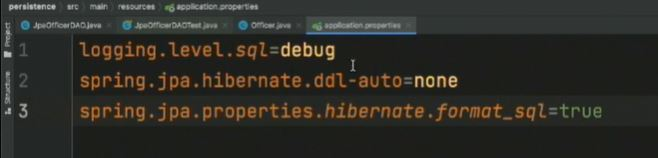

<!-- Start Document Outline -->

* [Spring Boot Fundamentals - O'Reilly](#spring-boot-fundamentals---oreilly)
	* [Module 1: A Simple Spring Model-View-Controller (MVC) Application](#module-1-a-simple-spring-model-view-controller-mvc-application)
	* [Module 2: Using Spring to Access REST Services](#module-2-using-spring-to-access-rest-services)
	* [Module 3: Persistence Mechanisms](#module-3-persistence-mechanisms)

<!-- End Document Outline -->

# Spring Boot Fundamentals - O'Reilly

## Module 1: A Simple Spring Model-View-Controller (MVC) Application
### Course Introduction
- Spring
    - built on top of JDK
    - will compare template vs restful service
    - testing + functional testing

### The Role of Spring in Application Development
- Java EE
    - infrastructure that provided services on demand
    - To provide services....
        - had to utilize enterprise javabeans  
        - had to sport servers
            - both not efficient
- Spring
    - 
    - Open source
        - shared services like
            - transactions
            - services
            - resource pooling
    - declarative services
        - provided by `beans`
        - consist of services like...
            - auto wiring
            - dependency injection
    - lifecycle management
        - classes are generated by spring
            - maintained IN MEMORY
            - provide references
                - ... aka... dependency injections
    - 
        - beans
            - POJO - plain old Java object
            - Java class with getters and setters
        - difference between Java EE and Spriing
            - declarative
                - similar services
                - ... but.... 
                    - do NOT need to acquire an instance and call it
                        - called programmatic service
                - instead of programmatic service...
                    - no instance... drop an annotation
                    - `@tran`saction` near your method 
    - 
    - 
        - to perform declarative functions...
            - must provide metadata
                - users change it with `JavaConfig` beans
                    - a way for users to define beans that Spring should be managing within application context
                - users can modify components with `Annotation` beans
                    - RESTcontrollers, repositories
    - 
        - execution context where Spring loads beans
            - access the beans through `ApplicationContext`
    - 
        - Purpose
            - create an easier way to create beans
            - easier auto configure a new Spring
        - Implementation
            - requires either maven or gradle
            - configure by filling out forms
            - auto-builds an initial web app with desired database drivers
        - easier configuration
            - take a class
            - serialize into json
            - spring boot will automatically get class to JSON 
    - 
        - IDE / spring tools suite / VScode

### Creating a New Application
- 
    - IMPORTANT -- Spring Boot Version
        - dictates what all dependencies look like
            - ie... correct Hibernate and JBDC versions
    - Java 11 - LTS for now
        - WAR packaging for serving webpages
        - JAR contains Tomcat for more flexibility with 
- 
    - Dependencies - Spring Web
        - ThymeLeaf for templating
- 
    - Generate compiles dependencies into a `demo.zip`
        - 

### Importing into an Integrated Development Environment (IDE)
- 
- 
- SpringToolSuite
    - Getting the jar within
        - 
        - 
        - 
    - Creating from scratch
        - 
        - 

### Adding a Controller
- Purpose
    - REST controller receives a request
        - returns a destination
- Creating a Controller
    - Create a class at File Location --- sec/main/java/nameOfApplication
        - 
    -  Name the new class
        - 
            - 
    - Turn the class into a controller with `@Controller`
        - 
            - 
    - Highlight the annotation to ascertain what is injected
        - 
            - Notice it is a `@Component`
    - Note that `@SpringBootApplication` within the main java is a `@ComponentScan`
        - 
            - 
    - Creating a controller
        - `@GetMapping` to associate a class with a specific route
            - 
        - create a public class that takes a `String` and a view model (`Model`)
            - 
                - note the types
                    - `name` parameter is a `String` types
                    - `model` output is a template model types
        - modify the String parameter with `@RequestParam` to dictate required parameter `/hello?name=Mike`
            - 
                - `value` dictates name of the parameter
                - `required` dictates requirement
                - `defaultValue` shows what the default value will be for parameter
        - `return` a template from the `src/main/resources/templates`
            - 
        - add `name` to the view model with `model.addAttribute()`
            - 
                - the viewmodel is `src/main/resources/templates/hello.html`
                    - 

### Adding a View
- Implementing a view
    - Utilize ThymeLeaf with html
        - 
- Running it 
    - 
    - 
    - 
        - 
- Configuring Java with `application.properties`
    - modifying logging with `logging.level.web=debug`
        - 
        - 
        - 

### Add an Index Page
- Add an index page (`index.html`)
    - 
        - 
    - 
        - 
- Outputting a Maven package
    - 
        - 
- Deploying the maven package
    - 

### Testing Controllers Part I
- Writing a JUnit test to invoke Controller class
    - 
        - JUnit turns `sayHello` into a `@Test`
        - `HelloController` is instantiated with `new HelloController()`
        - utilize view-model by `BindingAwareModelMap()`
            - Remember that `.sayHello` takes both a string and model
                - need to create the model
                    - 
        - utilize `assertAll` JUnit method to invoke all methods
- Note
    - Mockito
        - mocks the interface to properly test all inputs

### Testing Controllers Part II
- Documentation Pattern
    - Read the `Spring` doc
        - Check if it is simplified within `Spring Boot`
- Reading Documentation for Mocking Websites
    - Looking for "mock" on the spring framework documentation
        - 
    - Spring Documentation
        - 
    - Spring Boot Documentation
        - 
            - note that it 
                - auto-configures theMVC
                - looks for `@Controller` and NOT the `@Component`
            - example from the documentation
                - 
- Implementation 
    - 
        - `@WebMvcTest()` looks for the `HelloController.class` for the test
        - `@Autowired` tells Spring to check for `MockMvc` within `ApplicationContext`
            - to test if it worked
                - 
- Actual Test
    - 
        - Call the MockMvc instance with `mvc` and run the `.perform(get("/hello"))`
            - ensure the received is a HTML with `.accept(MediaType.TEXT_HTML)`
        - have mockMvc check the `status`, `view`, `model` with `.andExpect()`
        - in the second test... we insert a parameter with `mvc.paran("name","Dolly")`
    - Notice that `MockMvcRequesBuilders` handles all the REST verbs
        - 
    - Run the test
        - 
        - 

### Creating a RESTful Web Service
- Modern day application
    - Generate JSON for device
    - Device receives JSON
- Serializing a Greeting into JSON
    - Greeting class
        - 
    - `@RestController`
        - 
    - create a `@RestController` class method of `greet`
        - 
    - add mapping with `@GetMapping()`
        - 
    - add request parameters with `@RequestParam`
        - 
- Testing
    - 
    - 

### Testing RESTful Components
- Will be using `TestRestTemplate`
    - 
        - 
- Running a test on REST Controller `HelloRestControllerFunctionalTest`
    - Utilize a `@SpringBootTest` to create a test server with random port number
        - 
    - Run two `@Test`, be sure to `@Autowired` the TestRestTemplate
        - 
    - utilize the `TestRestTemplate` to turn `Greeting` into a JSON
        - 
    - the `.getForEntity` adds more data into the JSON... ie headers and status code, content type
        - 
            - 
            - notice we get the header, status code and content type
            - notice it is no longer a `response`... but a `ResponseEntity`

## Module 2: Using Spring to Access REST Services
* [Go to Module 3](#module-3-persistence-mechanisms)

### The Spring Application Context
- Application Context
    - auto wire your application context
        - 
            - 
    - see what is in the application context 
        - 
    - see all the beans with `.getBeanDefinitionCount()`
        - 
            - 
        - 
    - If you change the controllers name with `@Controller(newName)`
        - 
    - `Greeting.java` is NOT used in any part of the `ApplicationContext`
        - therefore...
            - never loaded
        - if we put it in the test...
            - 
        - to force `Greeting.java` to be used...
            - before...
                - 
            - after...
                - 
- NOTE
    - all objects within `ApplicationContext` are Singletons
        - 
            - we thought we created two separate instances of `Greeting.class`
                - instead...
                    - `greeting2` is just a reference to `greeting1`
    - ONLY WAY AROUND THIS... prototype it to be a factory
        - with `@Scope`

### Adding Beans Using JavaConfig
- Avoid `ApplicationContext` manipulation by setting configs with `JavaConfig`
    - 
        - 
- `@SpringBootApplication` has a configuration
    - Taking a look at the docs...
        - 
            - 
    - Typical `@Configuration` setup
        - 
            - annotate methods with an `@Bean` so that it would instantiates/configures that bean
    - Since `@SpringBootApplication` is a `@Configuration`...
        - 
    - Testing it...
        - 
- Moving the configurations to its own file
    - creating `AppConfig.java`
        - 
    - Creating an alternate greeting
        - 
            - 
    - Fixing the `expected single bean` error
        - 
            - 

### Spring's RestTemplate Class
- Intro
    - Will run an API through RestTemplate
        - the API source
            - 
            - 
            - 
                - Note the `people: [ { "name": "asdf", "craft":"asdf" }, ...` format
- Writing the API Fetcher
    - Organizing JSON into Java
        - Writing a POJO for the inbound data
            - Setting up the data structure
                - 
            - Establishing getters / setters
                - 
        - Writing a POJO for the outbound data
            - Data Structure
                - 
            - Establishing getters / setters
                - 
    - Creating a template
        - templates are created using `RestTemplateBuilder`
            - doc...
                - 
            - implementation
                - create a `RestTemplateBuilder` instance; call `.build()` method; insert into `template`
                    - 
                - note the different methods that could be invoked
                    - 
    - Calling API
        - utilize the `.getForObject()` from the URL; put it into `AstroResult` data structure
            - 
    - Create a service bean
        - What is a service
            - 
        - Implementation
            - 
- Testing the API Fetcher
    - Wire it to the API service bean
        - 
    - Call the test method
        - 
    - Within test method, call the service and store it
        - 
    - Within test method, print out the numbers
        - 
            - notice we are utilizing the `.getNumber()` getter
    - Within test method, print out all the people
        - 
    - Assert to check the results
        - 

### Using the Reactive WebClient Class
- Intro
    - Reactive WebClient
        - the modern version of `RestTemplate`
    - What is it...
        - 
            - an error won't stop the `ApplicationContext`
            - an infinite wait won't slow down the application
- `WebClient.ResponseSpec` `retrieve()`
    - the docs...
        - 
            - `.get()` acts like a GET html action
            - `.uri("")` dictates route that calls get function
            - `.accept()` dictates the anticipated file format
            - `.retrieve()` executes get action
            - `.bodyToMono()` converts JSON into Java class; name of java class is specified within `()`
    - implementation
        - instantiate a `WebClient`
            - 
        - wire the `WebClient.Builder` and build it on the API address
            - 
        - run the `retrieve()` library onto the `client`
            - 
    - testing
        - mostly the same; ensure to call the proper function
            - 

### Accessing the Google Geocoder
- What is Geocoding
    - Google definition
        - 
    - Two Required Parameters to be aware
        - 
        - 
    - Response
        - 
            - 
                - Note the `lat` `lng`
- Fitting Geocoding into Java
    - Lat / Lng Java Class
        - 
    - Geometry Class
        - 
    - Result Class (takes Geometry and returns LatLng)
        - 
    - Response Class (takes multiple results)
        - 
    - Site Class 
        - 
- Creating a Geocoder Service
    - Creating a `@Service` bean
        - 
    - `@Autowired` the `WebClient.Builder`
        - 
    - Create a method to retrieve the geocode json and 
        - `.collect()` the `Stream` of the input `address` in the `encoded`
            - 
        - send the `encoded` in a `.retrieve()` request
            - 
                - store the results within the `Response` format
    - getting the results we want...
        - to get the addresses...
            - run `Result`'s `getFormattedAddress()` on the response first
                - 
        - to get the lat / longd
            - run `Geometry`'s `getLocation()`
                - 
            - run `Location`'s `.getLat()` / `.getLng()`
                - 
- Testing the service
    - Writing the test
        - the first test (merely name of a city)
            - 
        - the second test (actual address)
            - 
        - notice we call the logger AFTER EVER `site` call
            - 
    - Results
        - HTTP GET request sent
            - 
        - Lat / Long3
            - 
        - fixing the `address: null`
            - difference in the documentation
                - 
                - 
            - check the config.... (`application.properties`)
                - 
        - getting the results
            - 

## Module 3: Persistence Mechanisms

### The JdbcTemplate Class
- Why `JdbcTemplate`?
    - want to pass SQL to database
        - NOT want to convert rows into objects
        - NOT want to convert objects into rows
- Documentation
    - 
    - 
        - Note that Jdbc will classify SQL exceptions as Data Access exceptions (3:25)
    - 
- Query (4:17)
    - `.queryForObject()`
        - sends a SQL query and returns a class object
            - NOTE ---> throws error IF NOT RETURN EXACTLY ONE ROW
                - 
    - SQL statement and the return class
        - 
            - `.queryForObject()`
                - first argument --> SQL statement
                - second argument --> Target once converted
    - SQL statement with a variable
        - 
            - third argument --> variable to be inserted into the SQL statement
    - Selecting a column based on `id`
        - 
            - second argument --> type of the expected return
            - third argument --> variable to be inserted into SQL statement
    - Mapping through all the roes
        - 
            - second argument --> row mapper interface
                - lambda that takes the entire row (`rowset`) and row num (`rowNum`)
                - lamda performs actions on each row
                    - here we create a new `Actor` object with a `first_name` and `last_name`
    - Querying multiple rows
        - 
            - note!!! using `.query()` instead of `.queryForObject()`
                - using `.query()` for returning an entire `resultSet`
            - note!!! no third argument
            - note!!! there is a type declaration at the beginning
                - `List<Actor>`
    - Better version -- abstracting the row mapper
        - 
- Update
    - perfer not to use `.update` 
        - does not return what is generated
- Spring Boot way
    - 

### Creating a Test Database
- From the very start
    - Spring Initializer
        - 
    - Dependencies - Spring JPA, H2 Database(JPA driver), 
        - 
        - 
    - sql files within `src/main/resources/`
        - 
    - Schema sql
        - 
    - Inserting data sql
        - 
    - Note
        - Spring will EXECUTE BOTH ON STARTUP
    - `application.properties` and logging
        - 

### Defining the Entities and the Data Access Object (DAO) Interface
- Maven POM
    - starter
        - 
    - dependencies
        - 
    - plugins
        - 
- Creating a DAO
    - data structure of `id` `rank` `firstname` `lastName` 
        - 
    - `rank` enum
        -  
    - three constructors
        - 
            - empty to handle if NO PARAMETERS are included
            - object WITHOUT `id` makes it easier for creating NEW classes
            - object WITH `id` makes it easier for retrieving FROM DATABASE
            - 
    - getters/setters
        - 
    - making an interface
        - 
            - `save()` takes an Officer and returns an Officer
                - the difference; the returned Officer will have an `id` or primary key
            - `findById()` takes an `id` and returns an OPTIONAL
                - why OPTIONAL????  
                    - just in case the returnee doesn't have an Officer
            - `findAll()` returns all Officer
            - `count()` return the number of rows
            - `existsById()` takes an `id` and returns a `boolean`

### Implementing the DAO Layer
- Writing methods for each DAO method
    - Be sure class implements the interface
        - 
    - Implement the JdbcTemplate
        - 
    - NOTE! in order to implement the wiring of the `JdbcTemplate`... need to be a Spring Managed bean
        - 
        - 
            - `@Repository` makes it a Spring repository
- `SimpleJdbcInsert`
    - insert `JdbcTemplate`
        - 
            - takes in `jdbcTemplate` and generates primary key
            - returns the primary key
    - tell it what table and what column needs the generated primary key
        - 
    - abstract the `SimpleJdbcInsert` as `insertOfficer` for the entire program
        - 
- Writing each method 
    - count()
        - 
    - delete()
        - 
    - `existsById()`
        - 
    - `findById()`
        - 
            - we MUST return ONLY ONE ROW.... so...
                - 
            - Notice we need three arguments
                - 
        - Simplified version
            - abstracted `officerMapper`
                - 
            - implement abstract
                - 
    - `save()`
        - 
            - call the prior made `SimpleJdbcTemplate` and run the `.executeAndReturnKey()`

### Testing the DAO Layer
- Hamcrest
    - framework that assists writing software tests in the Java programming language
        - supports customized assertion matchers
        - allowing match rules to be defined declaratively
- Spring Framework
    - has a host of all sorts of tests
        - assertJ
        - Mockito
- `@SpringBootTest`
    - sets up JUnit test
        - 
    - benefits - singleton application context
        - does not restart
        - maintains a single app context
- Steps
    - Utilize `@SpringBootTest`
        - 
    - Autowire your DAO model
        - 
    - testing `save()`
        - 
    - testing `findById()` for an id we know is IN database
        - 
    - testing `findById()` for an id we know is NOT IN database
        - 
    - testing `count()` to check for five items in database
        - 
    - testing `findAll()`
        - 
            - note we are using `containsInAnyOrder()` from Hamcrest
    - testing `delete()`
        - 
            - note we check if it exists PRIOR to deleting
            - note we check if database is empty by end
                - make sure to use LAST
    - testings if entries are in the table
        - 
            - note the `rangeClosed` and `.forEach()`
- Importance of `@Transactional`
    - Before
        - 
            - not all pass
    - After
        - 
            - `@Transactional` forces a roll back AFTER EACH TEST
            - 

### The Java Persistence API (JPA) and Hibernate
- Mapping to a Database Table using Hibernate
    - java class just for mappling class to database table
        - declare `@Entity`
            - 
        - correct for the name of the actual database table with `@Table`
            - 
        - remember that there must be a primary key
            - identify primary key with `@Id` and self generate it with `@GeneratedValue`
                - 
                    - 
        - take note of any `Enum`'s within the database
            - 
                - the default enum type is `Ordinal` ... or the position within like
                    - need to declare it as a string
    - Working on the DAO
        - auto wire for Jbdc database with `@Repository`
            - 
        - create the Jpa entity manager and invoke `@PersistenceContext`
            - 
                - you avoid creating a `entityManager` factory because of Singleton preference
        - working on each method
            - `save()` with Jpa `.persist()`
                - 
            - `findById()` with Jpa `.find()`
                - 
            - `findAll()` with Jpa `.createQuery()`
                - 
            - `count()` with Jpa `.createQuery()`
                - 
            - `delete()` with Jpa `.remove()`
                - 
            - `existsById()` with Jpa `.createQuery()`
                - 

### Testing the JPA DAO Implementation
- Steps
    - Make sure entire test case is running `@SpringBootTest` and `@Transactional`
        - 
            - SBT brings in testing dependencies
            - T ensures each test is done in isolation
    - Wire in your `dao` model
        - 
    - Wire in your JdbcTemplate 
        - 
            - to run SQL queries
    - need to critical methods that will be reused throughout... `getIds`
        - Be prepare to use row mapper / lambdas
            - `getIds` should run a query with a row mapper
                - 
    - test each critical database method
        - testing `.save`
            - 
        - 
            - 
        - 
            - 
        - 
            - 
        - 
            - 
        - testing
            - use Java's `.forEach()` to run `.existsById()` on each record
                - 
    - Learning to use Hibernate
        - test failure
            - 
                - Hibernate wants to generate database schema from your domain model
                - Hibernate looks at entity and recreates schema
                    - unless told otherwise... Hibernate will OVERWRITE all test
        - fixing Hibernate's default schema (`application.properties`)
            - 
            - 
            - `create-drop` is default; needs to be changed to none
                - 
        - telling Hibernate to use SQL
            - 
- Transaction behavior
    - Hibernate wants every access to be in a transaction

### Transactions in Spring
- 
    - 
        - 
    - 
        - 
- 
    - 
        - 
    - 
        - 

### The Spring Data JPA Project
- 
    - 
        - 
    - 
        - 
- 
    - 
        - 
    - 
        - 

### Putting It All Together
- 
    - 
        - 
    - 
        - 
- 
    - 
        - 
    - 
        - 

### Module 3 Summary
- 
    - 
        - 
    - 
        - 
- 
    - 
        - 
    - 
        - 

