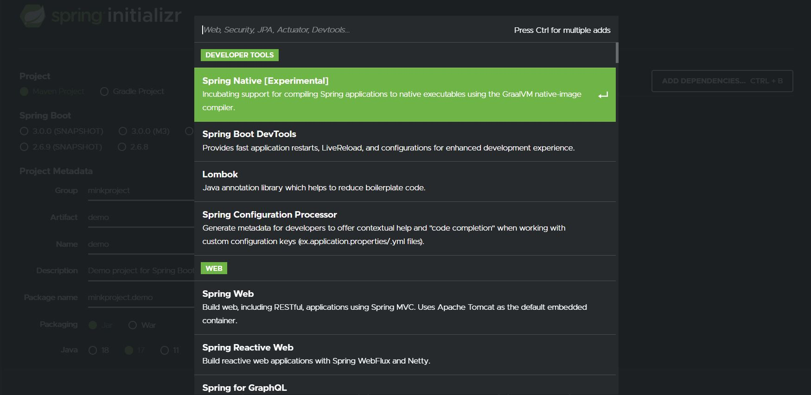
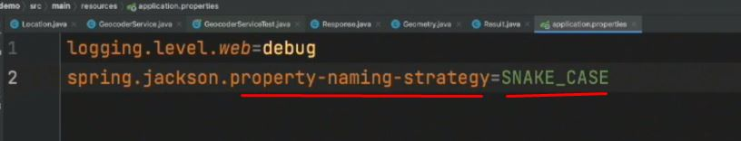

<!-- Start Document Outline -->

* [Spring Boot Fundamentals - O'Reilly](#spring-boot-fundamentals---oreilly)
	* [Module 1: A Simple Spring Model-View-Controller (MVC) Application](#module-1-a-simple-spring-model-view-controller-mvc-application)
	* [Module 2: Using Spring to Access REST Services](#module-2-using-spring-to-access-rest-services)
	* [Module 3: Persistence Mechanisms](#module-3-persistence-mechanisms)

<!-- End Document Outline -->

# Spring Boot Fundamentals - O'Reilly

## Module 1: A Simple Spring Model-View-Controller (MVC) Application
### Course Introduction
- Spring
    - built on top of JDK
    - will compare template vs restful service
    - testing + functional testing

### The Role of Spring in Application Development
- Java EE
    - infrastructure that provided services on demand
    - To provide services....
        - had to utilize enterprise javabeans  
        - had to sport servers
            - both not efficient
- Spring
    - 
    - Open source
        - shared services like
            - transactions
            - services
            - resource pooling
    - declarative services
        - provided by `beans`
        - consist of services like...
            - auto wiring
            - dependency injection
    - lifecycle management
        - classes are generated by spring
            - maintained IN MEMORY
            - provide references
                - ... aka... dependency injections
    - 
        - beans
            - POJO - plain old Java object
            - Java class with getters and setters
        - difference between Java EE and Spriing
            - declarative
                - similar services
                - ... but.... 
                    - do NOT need to acquire an instance and call it
                        - called programmatic service
                - instead of programmatic service...
                    - no instance... drop an annotation
                    - `@tran`saction` near your method 
    - 
    - 
        - to perform declarative functions...
            - must provide metadata
                - users change it with `JavaConfig` beans
                    - a way for users to define beans that Spring should be managing within application context
                - users can modify components with `Annotation` beans
                    - RESTcontrollers, repositories
    - 
        - execution context where Spring loads beans
            - access the beans through `ApplicationContext`
    - 
        - Purpose
            - create an easier way to create beans
            - easier auto configure a new Spring
        - Implementation
            - requires either maven or gradle
            - configure by filling out forms
            - auto-builds an initial web app with desired database drivers
        - easier configuration
            - take a class
            - serialize into json
            - spring boot will automatically get class to JSON 
    - 
        - IDE / spring tools suite / VScode

### Creating a New Application
- 
    - IMPORTANT -- Spring Boot Version
        - dictates what all dependencies look like
            - ie... correct Hibernate and JBDC versions
    - Java 11 - LTS for now
        - WAR packaging for serving webpages
        - JAR contains Tomcat for more flexibility with 
- 
    - Dependencies - Spring Web
        - ThymeLeaf for templating
- 
    - Generate compiles dependencies into a `demo.zip`
        - 

### Importing into an Integrated Development Environment (IDE)
- 
- 
- SpringToolSuite
    - Getting the jar within
        - 
        - 
        - 
    - Creating from scratch
        - 
        - 

### Adding a Controller
- Purpose
    - REST controller receives a request
        - returns a destination
- Creating a Controller
    - Create a class at File Location --- sec/main/java/nameOfApplication
        - 
    -  Name the new class
        - 
            - 
    - Turn the class into a controller with `@Controller`
        - 
            - 
    - Highlight the annotation to ascertain what is injected
        - 
            - Notice it is a `@Component`
    - Note that `@SpringBootApplication` within the main java is a `@ComponentScan`
        - 
            - 
    - Creating a controller
        - `@GetMapping` to associate a class with a specific route
            - 
        - create a public class that takes a `String` and a view model (`Model`)
            - 
                - note the types
                    - `name` parameter is a `String` types
                    - `model` output is a template model types
        - modify the String parameter with `@RequestParam` to dictate required parameter `/hello?name=Mike`
            - 
                - `value` dictates name of the parameter
                - `required` dictates requirement
                - `defaultValue` shows what the default value will be for parameter
        - `return` a template from the `src/main/resources/templates`
            - 
        - add `name` to the view model with `model.addAttribute()`
            - 
                - the viewmodel is `src/main/resources/templates/hello.html`
                    - 

### Adding a View
- Implementing a view
    - Utilize ThymeLeaf with html
        - 
- Running it 
    - 
    - 
    - 
        - 
- Configuring Java with `application.properties`
    - modifying logging with `logging.level.web=debug`
        - 
        - 
        - 

### Add an Index Page
- Add an index page (`index.html`)
    - 
        - 
    - 
        - 
- Outputting a Maven package
    - 
        - 
- Deploying the maven package
    - 

### Testing Controllers Part I
- Writing a JUnit test to invoke Controller class
    - 
        - JUnit turns `sayHello` into a `@Test`
        - `HelloController` is instantiated with `new HelloController()`
        - utilize view-model by `BindingAwareModelMap()`
            - Remember that `.sayHello` takes both a string and model
                - need to create the model
                    - 
        - utilize `assertAll` JUnit method to invoke all methods
- Note
    - Mockito
        - mocks the interface to properly test all inputs

### Testing Controllers Part II
- Documentation Pattern
    - Read the `Spring` doc
        - Check if it is simplified within `Spring Boot`
- Reading Documentation for Mocking Websites
    - Looking for "mock" on the spring framework documentation
        - 
    - Spring Documentation
        - 
    - Spring Boot Documentation
        - 
            - note that it 
                - auto-configures theMVC
                - looks for `@Controller` and NOT the `@Component`
            - example from the documentation
                - 
- Implementation 
    - 
        - `@WebMvcTest()` looks for the `HelloController.class` for the test
        - `@Autowired` tells Spring to check for `MockMvc` within `ApplicationContext`
            - to test if it worked
                - 
- Actual Test
    - 
        - Call the MockMvc instance with `mvc` and run the `.perform(get("/hello"))`
            - ensure the received is a HTML with `.accept(MediaType.TEXT_HTML)`
        - have mockMvc check the `status`, `view`, `model` with `.andExpect()`
        - in the second test... we insert a parameter with `mvc.paran("name","Dolly")`
    - Notice that `MockMvcRequesBuilders` handles all the REST verbs
        - 
    - Run the test
        - 
        - 

### Creating a RESTful Web Service
- Modern day application
    - Generate JSON for device
    - Device receives JSON
- Serializing a Greeting into JSON
    - Greeting class
        - 
    - `@RestController`
        - 
    - create a `@RestController` class method of `greet`
        - 
    - add mapping with `@GetMapping()`
        - 
    - add request parameters with `@RequestParam`
        - 
- Testing
    - 
    - 

### Testing RESTful Components
- Will be using `TestRestTemplate`
    - 
        - 
- Running a test on REST Controller `HelloRestControllerFunctionalTest`
    - Utilize a `@SpringBootTest` to create a test server with random port number
        - 
    - Run two `@Test`, be sure to `@Autowired` the TestRestTemplate
        - 
    - utilize the `TestRestTemplate` to turn `Greeting` into a JSON
        - 
    - the `.getForEntity` adds more data into the JSON... ie headers and status code, content type
        - 
            - 
            - notice we get the header, status code and content type
            - notice it is no longer a `response`... but a `ResponseEntity`

## Module 2: Using Spring to Access REST Services
* [Go to Module 3](#module-3-persistence-mechanisms)

### The Spring Application Context
- Application Context
    - auto wire your application context
        - 
            - 
    - see what is in the application context 
        - 
    - see all the beans with `.getBeanDefinitionCount()`
        - 
            - 
        - 
    - If you change the controllers name with `@Controller(newName)`
        - 
    - `Greeting.java` is NOT used in any part of the `ApplicationContext`
        - therefore...
            - never loaded
        - if we put it in the test...
            - 
        - to force `Greeting.java` to be used...
            - before...
                - 
            - after...
                - 
- NOTE
    - all objects within `ApplicationContext` are Singletons
        - 
            - we thought we created two separate instances of `Greeting.class`
                - instead...
                    - `greeting2` is just a reference to `greeting1`
    - ONLY WAY AROUND THIS... prototype it to be a factory
        - with `@Scope`

### Adding Beans Using JavaConfig
- Avoid `ApplicationContext` manipulation by setting configs with `JavaConfig`
    - 
        - 
- `@SpringBootApplication` has a configuration
    - Taking a look at the docs...
        - 
            - 
    - Typical `@Configuration` setup
        - 
            - annotate methods with an `@Bean` so that it would instantiates/configures that bean
    - Since `@SpringBootApplication` is a `@Configuration`...
        - 
    - Testing it...
        - 
- Moving the configurations to its own file
    - creating `AppConfig.java`
        - 
    - Creating an alternate greeting
        - 
            - 
    - Fixing the `expected single bean` error
        - 
            - 

### Spring's RestTemplate Class
- Intro
    - Will run an API through RestTemplate
        - the API source
            - 
            - 
            - 
                - Note the `people: [ { "name": "asdf", "craft":"asdf" }, ...` format
- Writing the API Fetcher
    - Organizing JSON into Java
        - Writing a POJO for the inbound data
            - Setting up the data structure
                - 
            - Establishing getters / setters
                - 
        - Writing a POJO for the outbound data
            - Data Structure
                - 
            - Establishing getters / setters
                - 
    - Creating a template
        - templates are created using `RestTemplateBuilder`
            - doc...
                - 
            - implementation
                - create a `RestTemplateBuilder` instance; call `.build()` method; insert into `template`
                    - 
                - note the different methods that could be invoked
                    - 
    - Calling API
        - utilize the `.getForObject()` from the URL; put it into `AstroResult` data structure
            - 
    - Create a service bean
        - What is a service
            - 
        - Implementation
            - 
- Testing the API Fetcher
    - Wire it to the API service bean
        - 
    - Call the test method
        - 
    - Within test method, call the service and store it
        - 
    - Within test method, print out the numbers
        - 
            - notice we are utilizing the `.getNumber()` getter
    - Within test method, print out all the people
        - 
    - Assert to check the results
        - 

### Using the Reactive WebClient Class
- Intro
    - Reactive WebClient
        - the modern version of `RestTemplate`
    - What is it...
        - 
            - an error won't stop the `ApplicationContext`
            - an infinite wait won't slow down the application
- `WebClient.ResponseSpec` `retrieve()`
    - the docs...
        - 
            - `.get()` acts like a GET html action
            - `.uri("")` dictates route that calls get function
            - `.accept()` dictates the anticipated file format
            - `.retrieve()` executes get action
            - `.bodyToMono()` converts JSON into Java class; name of java class is specified within `()`
    - implementation
        - instantiate a `WebClient`
            - 
        - wire the `WebClient.Builder` and build it on the API address
            - 
        - run the `retrieve()` library onto the `client`
            - 
    - testing
        - mostly the same; ensure to call the proper function
            - 

### Accessing the Google Geocoder
- What is Geocoding
    - Google definition
        - 
    - Two Required Parameters to be aware
        - 
        - 
    - Response
        - 
            - 
                - Note the `lat` `lng`
- Fitting Geocoding into Java
    - Lat / Lng Java Class
        - 
    - Geometry Class
        - 
    - Result Class (takes Geometry and returns LatLng)
        - 
    - Response Class (takes multiple results)
        - 
    - Site Class 
        - 
- Creating a Geocoder Service
    - Creating a `@Service` bean
        - 
    - `@Autowired` the `WebClient.Builder`
        - 
    - Create a method to retrieve the geocode json and 
        - `.collect()` the `Stream` of the input `address` in the `encoded`
            - 
        - send the `encoded` in a `.retrieve()` request
            - 
                - store the results within the `Response` format
    - getting the results we want...
        - to get the addresses...
            - run `Result`'s `getFormattedAddress()` on the response first
                - 
        - to get the lat / longd
            - run `Geometry`'s `getLocation()`
                - 
            - run `Location`'s `.getLat()` / `.getLng()`
                - 
- Testing the service
    - Writing the test
        - the first test (merely name of a city)
            - 
        - the second test (actual address)
            - 
        - notice we call the logger AFTER EVER `site` call
            - 
    - Results
        - HTTP GET request sent
            - 
        - Lat / Long3
            - 
        - fixing the `address: null`
            - difference in the documentation
                - 
                - 
            - check the config.... (`application.properties`)
                - 
        - getting the results
            - 

## Module 3: Persistence Mechanisms
### Module 3 Introduction
- 
    - 
        - 
    - 
        - 
- 
    - 
        - 
    - 
        - 

### The JdbcTemplate Class
- 
    - 
        - 
    - 
        - 
- 
    - 
        - 
    - 
        - 

### Creating a Test Database
- 
    - 
        - 
    - 
        - 
- 
    - 
        - 
    - 
        - 

### Defining the Entities and the Data Access Object (DAO) Interface
- 
    - 
        - 
    - 
        - 
- 
    - 
        - 
    - 
        - 

### Implementing the DAO Layer
- 
    - 
        - 
    - 
        - 
- 
    - 
        - 
    - 
        - 

### Testing the DAO Layer
- 
    - 
        - 
    - 
        - 
- 
    - 
        - 
    - 
        - 

### The Java Persistence API (JPA) and Hibernate
- 
    - 
        - 
    - 
        - 
- 
    - 
        - 
    - 
        - 

### Testing the JPA DAO Implementation
- 
    - 
        - 
    - 
        - 
- 
    - 
        - 
    - 
        - 

### Transactions in Spring
- 
    - 
        - 
    - 
        - 
- 
    - 
        - 
    - 
        - 

### The Spring Data JPA Project
- 
    - 
        - 
    - 
        - 
- 
    - 
        - 
    - 
        - 

### Putting It All Together
- 
    - 
        - 
    - 
        - 
- 
    - 
        - 
    - 
        - 

### Module 3 Summary
- 
    - 
        - 
    - 
        - 
- 
    - 
        - 
    - 
        - 

