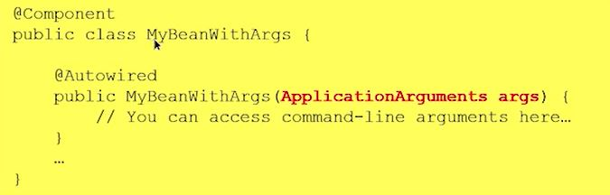
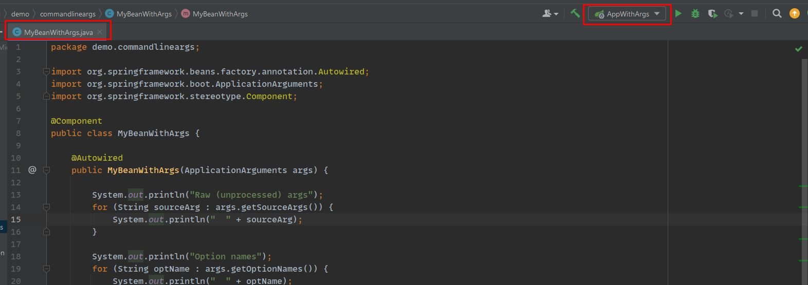

# Full-stack React with Spring Boot - Andy Olsen

### Lesson 1: Setting the Scene
#### 1.1 Overview of Full-Stack Applications
- Overview
    - Typical technologies on 
        - 
            - web ui
                - HTML / CSS / JS / framework(ie. React)
            - REST service
                - standard and open communication protocol
            - Web Server
                - logic for the service
                    - Spring Boot / ASP.NET / Python / Node.js
            - Persistence
                - Persist data
                    - Relational database
                        - MySQL
                    - NoSQL database
                        - MongoDB
                    - Cloud database
                        - AWS S3
                    - Mainframe storage
                        - IBM Z
        - 
            - Web UI
                - React
            - WebApp
                - Spring Boot
            - Persistence
                - H2
                    - for in-memory storage

#### 1.2 Understanding REST Services
- Definition of REST
    - 
        - user interacts with a website
        - website needs to change state
        - website react with new state after user interacts
    - 
        - 
            - HTTP actions
                - GET, POST, PUT, DELETE
                - 
            - 
            - 
        - 
            - Parts of the HTTP response
                - location - lets you know where change was made
                - 
            - Status Codes
                - 

#### 1.3 Creating Client-side Content
- 
    - Frontend that will communicate with backend VIA rest
- HTML
    - 
- CSS
    - 
- Javascript
    - 
        - 
        - 
        - 

### Lesson 2: Creating and Running Spring Boot Applications
#### 2.1 Creating a Simple Application Using Spring Boot CLI
- Getting Started
    - 
- Creating a spring boot app
    - 
- Maven project
    - 
        - `pom.xml` manifest of all dependencies
            - 
            - 
                - Parent for common dependencies
    - 
        - `src` holds all the application 
            - 
            - 
            - 
    - 
- To run...
    - 

#### 2.2 Creating a Web Application Using Spring Boot CLI
- Getting Started
    - 
        - 
    - create a maven dependency web app (dweb)
        -  
            - 
    - Maven web project includes `static` and `template`
        - 
    - static files go into static folder
        - 
    - Run the app after filling up static folder
        - 
    - Test
        - 

#### 2.3 Creating a Web Application Using IntelliJ
- Static Web App
    - new project
        - 
            - 
    - select spring initializer
        - 
    - artifact is the project name
        - 
    - observe created project
        - 
        - 
            - 
    - build --> run
        - 

#### 2.4 Implementing a Simple REST Service
- Overview
    - 
        - 
    - 
        - 
        - 

#### 2.5 Understanding Application Properties
- OVerview
    - 
        - 
    - it will autocomplete the property names and show the default values
        - 
            - don't change it if you like the default value
- Testing
    - 

### Lesson 3: Spring Boot Components and Beans
#### 3.1 Defining Component Classes and Accessing Beans
- Basics
    - 
        - Class component
            - automatically creates an instance
        - bean
            - an instance
- Components
    - 
        - `@Component`
            - used to designate classes that we want an instance of
        - `@Service`
            - used to designate classes that we want an business instance of
        - `@Respository`
            - used to designate classes that we want to have data access
        - `@Controller`
            - used to designate classes that we want to respond to HTTP req/res
        - `@RESTController`
            - used to designate classes that we want to respond to HTTP req/res
- Demo
    - 
        - 
            - component will create a bean/instance with a name in a lower case
            - `MyComponent` component will create a bean/instance with the name `mycomponent`
    - 
        - 
            - when this runs... beans are stored in the application context
    - 
        - 
            - created a reference within main class of the Application...
                - that references the get function of the `ctx` of the running `Application.class`
                    - and gets the `mycomponent` bean of the `MyComponent.class`
    - 
        - 
            - 
            - 

#### 3.2 Understanding Bean Scope and Initialization
- Basics
    - Prototype vs Singleton
        - Prototype creates a separate instance with every invocation
        - Single creates only once instance and checks for that instance with every invocation
    - Default
        - singleton
            - 
- Singleton-Scope Bean
    - 
        - 
            - suppose to store the instance value `id` and `printf()` it
            - if another instance is created... `nextId++` should be triggered giving the next instance a new `id`
        - 
            - within the `Application.main` class, we call `demoSingleton` with the context of `SpringApplication.run(Application.class)`
            - inside of `demoSingleton` .. we attempt to run `ctx` with `getBean()` three times
        - 
    - If you have a tedious bean to generate (20min+)...
        - lazy initiation
            - Purpose
                - Bean generation (unless specified) will always occur during `SpringApplication.run()`
                - if you want to avoid a long application startup and can spare the guilty bean...
                    - you can generate bean later ... aka... lazy load it with `@Lazy`
                        - will be generate ONLY when called
            - implementation
                - 
                - 
- Different Scope
    - 
        - dictate where the data of bean is stored...
            - `"request"` will store data only during request and will be dumped after successful transmission
            - `"session"` storing data only during allotted user time, 
                - banks may limit it to 30 minutes and sign you out
            - `"application"` stores data during the lifetime of webapp
                - if it is restarted... loses that data
- Prototype Bean
    - Application
        - 
    - Prototype Class
        - 
            - 

#### 3.3 Autowiring
- Overview
    - Will setup a dependency between service and repository
        - 
    - Will need to qualify the dependency so that the Repo knows where to store data
        - 
- Code Breakdown
    - BankRepository
        - 
            - `BankRepositoryImpl` implements `BankRepository`, creating a single instance with `@Repository`
            - Interface consist of `createAccount()`, `getBalance()`, `updateBalance()`, and `deleteAccount()`
    - BankService
        - 
            - Interface consist of `depositIntoAccount()`, `withdrawFromAccount()`, `transferFunds()`
            - `BankServiceImpl` implements `BankService`, creating a single instance with `@Service`
    - `@Autowired`
        - stored within `BankServiceImpl`
        - connects with `BankRepositoryImpl` bean
- Injecting Dependencies into Fields
    - 
        - if you need a bean to run and draw info from (dependency)...
            - `@Autowired` that needed bean within
        - 
- Injecting Dependencies into a Constructor
    - 
        - 
- Qualifying Autowiring
    - 
        - 
- Optional Autowiring
    - Avoid runtime error by making the maybe-not-there repo optional
        - 

#### 3.4 Additional Autowiring Techniques
- If you want a `collection` of repository (ie. a collection of PostgreSQL, MySQL, Oracle)
    - 
- If you have a `map` of repository
    - 
- If you want to inject the value of a variable, i.e. value of `name`
    - 
- If you want to inject the value of a Spring Expression Language   `"#{value}"`
    - 

#### 3.5 Using Spring Expression Language (SpEL)
- Basic
    - 
- Creating an object
    - 
- Calling a static method 
    - Basic of static method
        - method that belongs to a class rather than an instance of a class
        - not part of the objects it creates but is part of a class definition
        - referenced by the class name and can be invoked without creating an object of class
    - 
        - 
- Accessing items within `array`s, `collection`s, and `map`s
    - 
        - Creating a `list` and `map`
            - 
        - Accessing `list` of `cities` and `map` of `currencies`
            - 
- Accessing items with operators
    - utilizing ***select all*** with `?[]` operator
        - 
    - utilizing ***select first*** with `^[]` operator
        - 
    - utilizing ***select last*** with `$[]` operator
        - 
    - utilizing ***transform all*** with `![]` operator
        - 
- Accessing parameters within an `@Autowire`
    - 
        - `@Value` pulls the `user.name` from `systemProperties` and inserts it into method
            - what is `@Autowired`

#### 3.6 Working with Command-Line Arguments
- Overview of CLI arguments and Spring Boot startup up
    - 
        - `args` passed in when `SpringApplication.run()` creates the beans
- To access `args` FROM THE BEAN....
    - must `@Autowired` with `(ApplicationArguments)`
        - 
- Two types of CLI arguments
    - Options
        - 
            - consist of ... `--name` and `=value`
        - 
            - actual value
- Inputing command-line arguments with IntelliJ
    - 
    - create a new configuration
        - 
        - 
        - 
    - apply arguments
        - 
        - 
- Accessing arguments within bean using these methods...
    - `getSourceArgs()`
        - gets raw arguments like `--target=windows`
    - `getOptionNames()`
        - gets names of option arguments 
            - `--target=windows` returns `target`
    - `getOptionValues()`
        - gets values of option arguments 
            - `--target=windows` returns `windows`
    - `getNonOptionArgs()`
        - all the values that didn't have a name
            - `--target=windows --target=macOS --db=h2 wales 56` returns `wales 56`
- Accessing arguments within
    - `getSourceArgs()` with `--target=windows --target=macOS --db=h2 wales 56`
        - 
    - `getOptionNames()` with `--target=windows --target=macOS --db=h2 wales 56`
        - 
    - `getOptionValues()` with `--target=windows --target=macOS --db=h2 wales 56`
        - 
    - `getNonOptionArgs()` with `--target=windows --target=macOS --db=h2 wales 56`
        - 

### Lesson 4: Configuration Classes
#### 4.1 Defining a Configuration Class and Beans
- 
    - 
        - 
    - 
        - 
- 
    - 
        - 
    - 
        - 
#### 4.2 Locating Configuration Classes and Bean Methods
- 
    - 
        - 
    - 
        - 
- 
    - 
        - 
    - 
        - 
#### 4.3 Configuration Techniques
- 
    - 
        - 
    - 
        - 
- 
    - 
        - 
    - 
        - 
#### 4.4 Configuring Bean Dependencies
- 
    - 
        - 
    - 
        - 
- 
    - 
        - 
    - 
        - 
### Lesson 5: Spring Boot Techniques
#### 5.1 Setting Application Properties at the Command Line
- 
    - 
        - 
    - 
        - 
- 
    - 
        - 
    - 
        - 
#### 5.2 Specifying which Properties File to Use
- 
    - 
        - 
    - 
        - 
- 
    - 
        - 
    - 
        - 
#### 5.3 Defining YAML Properties Files
- 
    - 
        - 
    - 
        - 
- 
    - 
        - 
    - 
        - 
#### 5.4 Using Spring Profiles
- 
    - 
        - 
    - 
        - 
- 
    - 
        - 
    - 
        - 
#### 5.5 Using Spring Boot Actuator
- 
    - 
        - 
    - 
        - 
- 
    - 
        - 
    - 
        - 
### Lesson 6: Integrating with Data Sources
#### 6.1 Understanding Spring Data
- 
    - 
        - 
    - 
        - 
- 
    - 
        - 
    - 
        - 
#### 6.2 Getting Started with JPA
- 
    - 
        - 
    - 
        - 
- 
    - 
        - 
    - 
        - 
#### 6.3 Configuring JPA in Spring Boot
- 
    - 
        - 
    - 
        - 
- 
    - 
        - 
    - 
        - 
#### 6.4 Defining JPA Entity Classes
- 
    - 
        - 
    - 
        - 
- 
    - 
        - 
    - 
        - 
#### 6.5 Seeding the Database with Sample Data
- 
    - 
        - 
    - 
        - 
- 
    - 
        - 
    - 
        - 
#### 6.6 Viewing Database Data
- 
    - 
        - 
    - 
        - 
- 
    - 
        - 
    - 
        - 
#### 6.7 Introducing the EntityManager Class
- 
    - 
        - 
    - 
        - 
- 
    - 
        - 
    - 
        - 
#### 6.8 Using Query Methods in the EntityManager Class
- 
    - 
        - 
    - 
        - 
- 
    - 
        - 
    - 
        - 
#### 6.9 Modifying Entities
- 
    - 
        - 
    - 
        - 
- 
    - 
        - 
    - 
        - 
### Lesson 7: Working with Spring Data Repositories
#### 7.1 Understanding Spring Data Repositories
- 
    - 
        - 
    - 
        - 
- 
    - 
        - 
    - 
        - 
#### 7.2 Defining a Spring Data Repository Interface
- 
    - 
        - 
    - 
        - 
- 
    - 
        - 
    - 
        - 
#### 7.3 Using a Spring Data Repository Interface  
- 
    - 
        - 
    - 
        - 
- 
    - 
        - 
    - 
        - 
#### 7.4 Getting Started with MongoDB   
- 
    - 
        - 
    - 
        - 
- 
    - 
        - 
    - 
        - 
#### 7.5 Working with Collections in MongoDB
- 
    - 
        - 
    - 
        - 
- 
    - 
        - 
    - 
        - 
#### 7.6 Defining a MongoDB Data Layer in Spring Boot
- 
    - 
        - 
    - 
        - 
- 
    - 
        - 
    - 
        - 
#### 7.7 Using a MongoDB Data Layer in Spring Boot
- 
    - 
        - 
    - 
        - 
- 
    - 
        - 
    - 
        - 
### Lesson 8: Implementing and Consuming REST Services
#### 8.1 Getting Started with REST Services in Spring Boot
- 
    - 
        - 
    - 
        - 
- 
    - 
        - 
    - 
        - 
#### 8.2 Defining a Simple REST Service
- 
    - 
        - 
    - 
        - 
- 
    - 
        - 
    - 
        - 
#### 8.3 Defining a Full REST API
- 
    - 
        - 
    - 
        - 
- 
    - 
        - 
    - 
        - 
#### 8.4 Implementing POST, PUT, and DELETE Endpoints
- 
    - 
        - 
    - 
        - 
- 
    - 
        - 
    - 
        - 
#### 8.5 Defining a REST Client
- 
    - 
        - 
    - 
        - 
- 
    - 
        - 
    - 
        - 
#### 8.6 Consuming REST Endpoints
- 
    - 
        - 
    - 
        - 
- 
    - 
        - 
    - 
        - 
### Lesson 9: Creating a React Front-End
#### 9.1 Creating a Simple React Web App
- 
    - 
        - 
    - 
        - 
- 
    - 
        - 
    - 
        - 
#### 9.2 Defining Components
- 
    - 
        - 
    - 
        - 
- 
    - 
        - 
    - 
        - 
#### 9.3 Creating an Industrial-Strength React Application
- 
    - 
        - 
    - 
        - 
- 
    - 
        - 
    - 
        - 
#### 9.4 Building and Running an Industrial-Strength React Application
- 
    - 
        - 
    - 
        - 
- 
    - 
        - 
    - 
        - 
#### 9.5 A Closer Look at Components
- 
    - 
        - 
    - 
        - 
- 
    - 
        - 
    - 
        - 
#### 9.6 Passing Multiple Properties into a Component
- 
    - 
        - 
    - 
        - 
- 
    - 
        - 
    - 
        - 
### Lesson 10: Consuming a REST API from React
#### 10.1 Implementing a Data Model in a Server Application
- 
    - 
        - 
    - 
        - 
- 
    - 
        - 
    - 
        - 
#### 10.2 Implementing a REST API in a Server Application
- 
    - 
        - 
    - 
        - 
- 
    - 
        - 
    - 
        - 
#### 10.3 Getting Started with a React REST Client Application
- 
    - 
        - 
    - 
        - 
- 
    - 
        - 
    - 
        - 
#### 10.4 Calling a REST Service
- 
    - 
        - 
    - 
        - 
- 
    - 
        - 
    - 
        - 
#### 10.5 Using the async and await Keywords
- 
    - 
        - 
    - 
        - 
- 
    - 
        - 
    - 
        - 
### Lesson 11: Implementing a Compelling UI in React
#### 11.1 Introducing the Example Application
- 
    - 
        - 
    - 
        - 
- 
    - 
        - 
    - 
        - 
#### 11.2 Implementing Routing
- 
    - 
        - 
    - 
        - 
- 
    - 
        - 
    - 
        - 
#### 11.3 Displaying All Destinations
- 
    - 
        - 
    - 
        - 
- 
    - 
        - 
    - 
        - 
#### 11.4 Displaying One Destination
- 
    - 
        - 
    - 
        - 
- 
    - 
        - 
    - 
        - 
#### 11.5 Displaying and Adding Reviews for a Destination
- 
    - 
        - 
    - 
        - 
- 
    - 
        - 
    - 
        - 