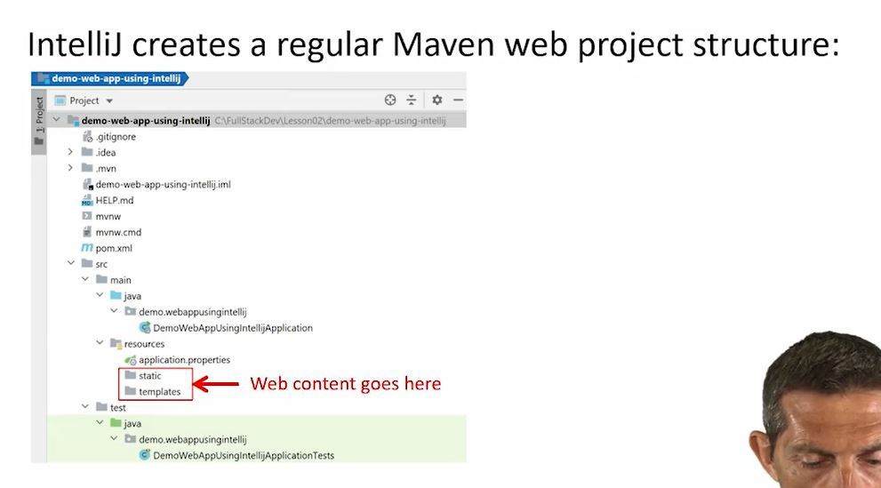

# Full-stack React with Spring Boot - Andy Olsen

### Lesson 1: Setting the Scene
#### 1.1 Overview of Full-Stack Applications
- Overview
    - Typical technologies on 
        - 
            - web ui
                - HTML / CSS / JS / framework(ie. React)
            - REST service
                - standard and open communication protocol
            - Web Server
                - logic for the service
                    - Spring Boot / ASP.NET / Python / Node.js
            - Persistence
                - Persist data
                    - Relational database
                        - MySQL
                    - NoSQL database
                        - MongoDB
                    - Cloud database
                        - AWS S3
                    - Mainframe storage
                        - IBM Z
        - 
            - Web UI
                - React
            - WebApp
                - Spring Boot
            - Persistence
                - H2
                    - for in-memory storage

#### 1.2 Understanding REST Services
- Definition of REST
    - 
        - user interacts with a website
        - website needs to change state
        - website react with new state after user interacts
    - 
        - 
            - HTTP actions
                - GET, POST, PUT, DELETE
                - 
            - 
            - 
        - 
            - Parts of the HTTP response
                - location - lets you know where change was made
                - 
            - Status Codes
                - 

#### 1.3 Creating Client-side Content
- 
    - Frontend that will communicate with backend VIA rest
- HTML
    - 
- CSS
    - 
- Javascript
    - 
        - 
        - 
        - 

### Lesson 2: Creating and Running Spring Boot Applications
#### 2.1 Creating a Simple Application Using Spring Boot CLI
- Getting Started
    - 
- Creating a spring boot app
    - 
- Maven project
    - 
        - `pom.xml` manifest of all dependencies
            - 
            - 
                - Parent for common dependencies
    - 
        - `src` holds all the application 
            - 
            - 
            - 
    - 
- To run...
    - 

#### 2.2 Creating a Web Application Using Spring Boot CLI
- Getting Started
    - 
        - 
    - create a maven dependency web app (dweb)
        -  
            - 
    - Maven web project includes `static` and `template`
        - 
    - static files go into static folder
        - 
    - Run the app after filling up static folder
        - 
    - Test
        - 

#### 2.3 Creating a Web Application Using IntelliJ
- Static Web App
    - new project
        - 
            - 
    - select spring initializer
        - 
    - artifact is the project name
        - 
    - observe created project
        - 
        - 
            - 
    - build --> run
        - 

#### 2.4 Implementing a Simple REST Service
- Overview
    - 
        - 
    - 
        - 
        - 

#### 2.5 Understanding Application Properties
- OVerview
    - 
        - 
    - 
        - 
- 
    - 
        - 
    - 
        - 

### Lesson 3: Spring Boot Components and Beans
#### 3.1 Defining Component Classes and Accessing Beans
- 
    - 
        - 
    - 
        - 
- 
    - 
        - 
    - 
        - 

#### 3.2 Understanding Bean Scope and Initialization
- 
    - 
        - 
    - 
        - 
- 
    - 
        - 
    - 
        - 

#### 3.3 Autowiring
- 
    - 
        - 
    - 
        - 
- 
    - 
        - 
    - 
        - 

#### 3.4 Using Spring Expression Language (SpEL)
- 
    - 
        - 
    - 
        - 
- 
    - 
        - 
    - 
        - 

#### 3.5 Working with Command-Line Arguments
- 
    - 
        - 
    - 
        - 
- 
    - 
        - 
    - 
        - 

### Lesson 4: Configuration Classes
#### 4.1 Defining a Configuration Class and Beans
- 
    - 
        - 
    - 
        - 
- 
    - 
        - 
    - 
        - 
#### 4.2 Locating Configuration Classes and Bean Methods
- 
    - 
        - 
    - 
        - 
- 
    - 
        - 
    - 
        - 
#### 4.3 Configuration Techniques
- 
    - 
        - 
    - 
        - 
- 
    - 
        - 
    - 
        - 
#### 4.4 Configuring Bean Dependencies
- 
    - 
        - 
    - 
        - 
- 
    - 
        - 
    - 
        - 
### Lesson 5: Spring Boot Techniques
#### 5.1 Setting Application Properties at the Command Line
- 
    - 
        - 
    - 
        - 
- 
    - 
        - 
    - 
        - 
#### 5.2 Specifying which Properties File to Use
- 
    - 
        - 
    - 
        - 
- 
    - 
        - 
    - 
        - 
#### 5.3 Defining YAML Properties Files
- 
    - 
        - 
    - 
        - 
- 
    - 
        - 
    - 
        - 
#### 5.4 Using Spring Profiles
- 
    - 
        - 
    - 
        - 
- 
    - 
        - 
    - 
        - 
#### 5.5 Using Spring Boot Actuator
- 
    - 
        - 
    - 
        - 
- 
    - 
        - 
    - 
        - 
### Lesson 6: Integrating with Data Sources
#### 6.1 Understanding Spring Data
- 
    - 
        - 
    - 
        - 
- 
    - 
        - 
    - 
        - 
#### 6.2 Getting Started with JPA
- 
    - 
        - 
    - 
        - 
- 
    - 
        - 
    - 
        - 
#### 6.3 Configuring JPA in Spring Boot
- 
    - 
        - 
    - 
        - 
- 
    - 
        - 
    - 
        - 
#### 6.4 Defining JPA Entity Classes
- 
    - 
        - 
    - 
        - 
- 
    - 
        - 
    - 
        - 
#### 6.5 Seeding the Database with Sample Data
- 
    - 
        - 
    - 
        - 
- 
    - 
        - 
    - 
        - 
#### 6.6 Viewing Database Data
- 
    - 
        - 
    - 
        - 
- 
    - 
        - 
    - 
        - 
#### 6.7 Introducing the EntityManager Class
- 
    - 
        - 
    - 
        - 
- 
    - 
        - 
    - 
        - 
#### 6.8 Using Query Methods in the EntityManager Class
- 
    - 
        - 
    - 
        - 
- 
    - 
        - 
    - 
        - 
#### 6.9 Modifying Entities
- 
    - 
        - 
    - 
        - 
- 
    - 
        - 
    - 
        - 
### Lesson 7: Working with Spring Data Repositories
#### 7.1 Understanding Spring Data Repositories
- 
    - 
        - 
    - 
        - 
- 
    - 
        - 
    - 
        - 
#### 7.2 Defining a Spring Data Repository Interface
- 
    - 
        - 
    - 
        - 
- 
    - 
        - 
    - 
        - 
#### 7.3 Using a Spring Data Repository Interface  
- 
    - 
        - 
    - 
        - 
- 
    - 
        - 
    - 
        - 
#### 7.4 Getting Started with MongoDB   
- 
    - 
        - 
    - 
        - 
- 
    - 
        - 
    - 
        - 
#### 7.5 Working with Collections in MongoDB
- 
    - 
        - 
    - 
        - 
- 
    - 
        - 
    - 
        - 
#### 7.6 Defining a MongoDB Data Layer in Spring Boot
- 
    - 
        - 
    - 
        - 
- 
    - 
        - 
    - 
        - 
#### 7.7 Using a MongoDB Data Layer in Spring Boot
- 
    - 
        - 
    - 
        - 
- 
    - 
        - 
    - 
        - 
### Lesson 8: Implementing and Consuming REST Services
#### 8.1 Getting Started with REST Services in Spring Boot
- 
    - 
        - 
    - 
        - 
- 
    - 
        - 
    - 
        - 
#### 8.2 Defining a Simple REST Service
- 
    - 
        - 
    - 
        - 
- 
    - 
        - 
    - 
        - 
#### 8.3 Defining a Full REST API
- 
    - 
        - 
    - 
        - 
- 
    - 
        - 
    - 
        - 
#### 8.4 Implementing POST, PUT, and DELETE Endpoints
- 
    - 
        - 
    - 
        - 
- 
    - 
        - 
    - 
        - 
#### 8.5 Defining a REST Client
- 
    - 
        - 
    - 
        - 
- 
    - 
        - 
    - 
        - 
#### 8.6 Consuming REST Endpoints
- 
    - 
        - 
    - 
        - 
- 
    - 
        - 
    - 
        - 
### Lesson 9: Creating a React Front-End
#### 9.1 Creating a Simple React Web App
- 
    - 
        - 
    - 
        - 
- 
    - 
        - 
    - 
        - 
#### 9.2 Defining Components
- 
    - 
        - 
    - 
        - 
- 
    - 
        - 
    - 
        - 
#### 9.3 Creating an Industrial-Strength React Application
- 
    - 
        - 
    - 
        - 
- 
    - 
        - 
    - 
        - 
#### 9.4 Building and Running an Industrial-Strength React Application
- 
    - 
        - 
    - 
        - 
- 
    - 
        - 
    - 
        - 
#### 9.5 A Closer Look at Components
- 
    - 
        - 
    - 
        - 
- 
    - 
        - 
    - 
        - 
#### 9.6 Passing Multiple Properties into a Component
- 
    - 
        - 
    - 
        - 
- 
    - 
        - 
    - 
        - 
### Lesson 10: Consuming a REST API from React
#### 10.1 Implementing a Data Model in a Server Application
- 
    - 
        - 
    - 
        - 
- 
    - 
        - 
    - 
        - 
#### 10.2 Implementing a REST API in a Server Application
- 
    - 
        - 
    - 
        - 
- 
    - 
        - 
    - 
        - 
#### 10.3 Getting Started with a React REST Client Application
- 
    - 
        - 
    - 
        - 
- 
    - 
        - 
    - 
        - 
#### 10.4 Calling a REST Service
- 
    - 
        - 
    - 
        - 
- 
    - 
        - 
    - 
        - 
#### 10.5 Using the async and await Keywords
- 
    - 
        - 
    - 
        - 
- 
    - 
        - 
    - 
        - 
### Lesson 11: Implementing a Compelling UI in React
#### 11.1 Introducing the Example Application
- 
    - 
        - 
    - 
        - 
- 
    - 
        - 
    - 
        - 
#### 11.2 Implementing Routing
- 
    - 
        - 
    - 
        - 
- 
    - 
        - 
    - 
        - 
#### 11.3 Displaying All Destinations
- 
    - 
        - 
    - 
        - 
- 
    - 
        - 
    - 
        - 
#### 11.4 Displaying One Destination
- 
    - 
        - 
    - 
        - 
- 
    - 
        - 
    - 
        - 
#### 11.5 Displaying and Adding Reviews for a Destination
- 
    - 
        - 
    - 
        - 
- 
    - 
        - 
    - 
        - 